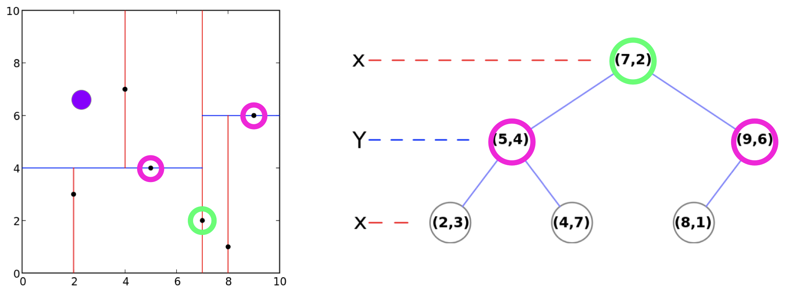
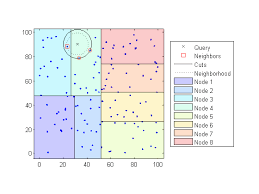

# Prototype DEMO open remote geclusterde data

Hoofdvraag:

<strong>Hoe toon ik een geclusterde data set met mapbox?</strong>

Deze repository is een bewijslast voor het opzetten van een demo project waarbij data 
geclusterd wordt weergegeven. Voor dit project was het onduidelijk over hoe
dit geimplementeerd kon worden. In deze demo wordt succesvol aangetoond dat het mogelijk
is met mapbox. 

## Hoe zet ik dit project op?

### Server

Zorg ervoor dat het project draait op een apache of nginx server. 

### Composer

Installeer composer en voor het commando `composer install` uit in de root van het project.

### NPM

Installeer npm en voer het commando `npm install` uit in de root van het project. 

### Bezoek demo pagina

Ga nu naar de browser en bezoek het domein waar dit project staat. Bijv. https://localhost::8080

## Zodra het project is opgezet ziet het er als volgt uit:

<strong>Overzicht</strong>

<strong>Geclusterde data</strong>

<strong>Geclusterde data ingezoomd</strong>

# Clustering

De data die ingeladen wordt, word in het begin opgesplitst in een kd-tree. Door middel van het KNN algoritme kan een kd-tree worden opgebouwd. 
Het KNN algoritme zorgt voor het opzoeken van de dichtstbijzijnde buren in een cijferreeks. 
In de aangeleverde data staan de cijferreeksen gedefinieerd in het longitude en latitude formaat. 

Een kd-tree wordt opgebouwd aan de hand van vooraf gedefinieerde nodes die de precisie bepalen van de clusters. 
Dus hoe groter het aantal nodes hoe preciezer de verdeling van de datapunten. 
Hoe een gebied wordt gedefinieerd is gevisualiseerd aan de hand van een tekening die we hebben gemaakt. 

In een getallenreeks van longtitude en latitude wordt de tree opgebouwd door een begingetal te pakken. 
Als het getal hoger is dan dan wordt dat getal in de boom naar een stapje naar onder en rechts gezet. 
Als het getal lager is wordt het getal in de boom naar links toe gezet. 

Vervolgens worden de getallen op een grafiek gezet worden er afhankelijk van de hoogte van de node lijnen doorheen getrokken.
Zo krijgt de eerste node een lijn door de x-as en de tweede door de y-as enzovoorts. 

Op het moment dat de lijnen van de verschillende nodes doorgetrokken zijn worden de clusters gedefinieerd aan de hand van de vakken waarin de datapunten vallen. 

